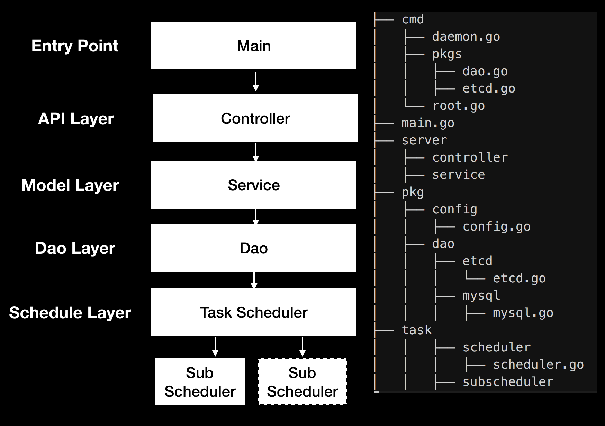

#### 项目需求描述
```text
    1. 熟悉补偿设计模式，根据补偿模式原理，设计几个任务状态机，比如begin、pending、doing、done
    2. 设计相应的任务状态处理方法，比如 handleBegin、handlePending、handleDoing
    3. 支持分布式任务调度，通过 etcd 设置全局锁，保证每个任务执行由一个分布式节点来执行,否则一个任务被执行多次
    4. 使用 "github.com/gorilla/mux" 设计 controller 路由和RESP Api
    5. 设计 Dao 模块，将通过API创建的操作实例，存储到数据库
    6. 设计 Scheduler调度器，通过轮训数据库中任务状态，和资源类型，选择相应的sub Scheduler去执行
    7. 使用 mysql 数据库存储任务状态和任务对象实例
    8. 使用cobra 创建和管理整个应用,使用Viper 解析配置文件
```

#### 项目结构


#### 补偿模式

